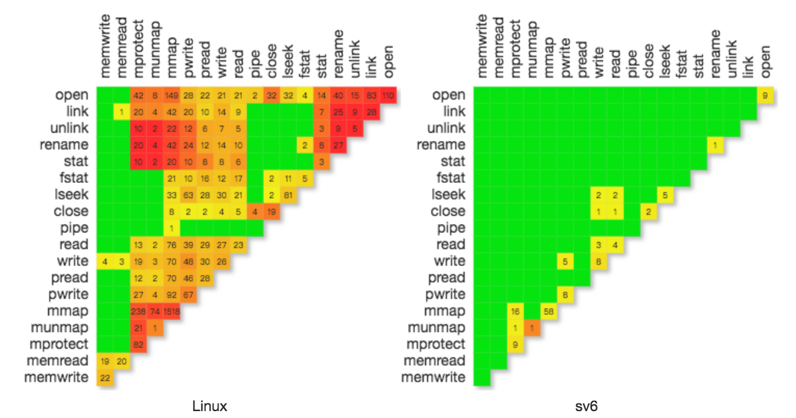
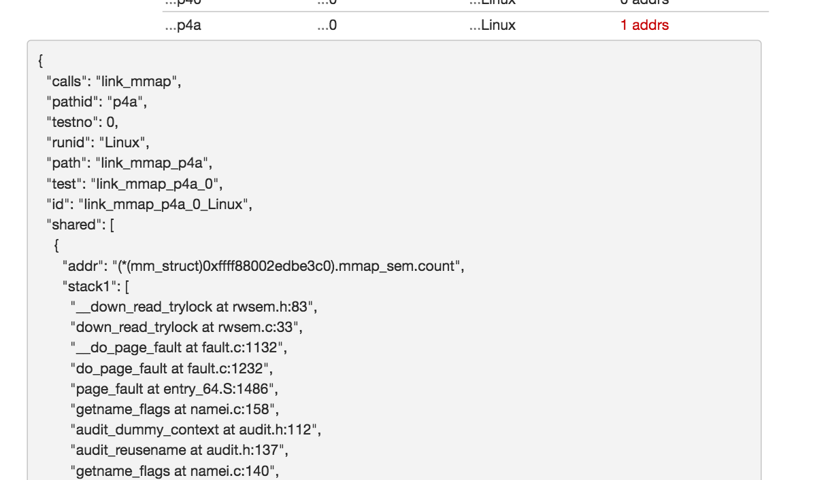

# The Scalable Commutativity Rule: Designing Scalable Software for Multicore Processors 


### Summary of major innovations （主要贡献）

由于OS api设计限制多核性能下降，作者团队分析其中原因，用调用交换原则，设计COMMUTER用于自动化评估POSIX syscall的可扩展性，定位瓶颈，并据此开发sv6 os，实现远高于linux的接口冲突规避率。


### What the problems the paper mentioned?（解决的主要问题）

总的来说，在多核运行环境下，操作系统中程序运行的效率并没有随着进程/线程增加而线性增长，面临可扩展性的问题。而这个可扩展性问题的解决一般要通过开发、测试、定位瓶颈等过程不断迭代，解决可扩展性问题关键所在，让程序运行并行性变好。

但是传统的这种改善过程效率低，且不断有新的问题产生，并且当开销均匀分布到程序各个部分以后，很多问题都无从下手。


### How about the important related works/papers?

* sraeli和Rappoport提出了程序可扩展性能力和内存系统设计紧密相关…...
* MCS lock设计作为一个案例可以证明cache-line的设计约定导致可扩展性不理想。
* 可交换性：Steele 描述了并行程序操作顺讯可交换性是并行性的一种表示，Rinard和Diniz 利用可交换性去除内存冲突……作者采用交换程序执行顺序观测返回结果的形式来推断interface操作是否存在冲突，并找到冲突点
* 冲突testcase生成：利用符号执行技术，参考QuickCheck 和Gast的实现


### What are some intriguing aspects of the paper?

在这样的大环境下，作者团队希望从high level的角度来面对这个挑战，所以他们关注到OS最基本的interface部分，这里的OS接口指的是系统调用syscall。POSIX定义了linux OS interface设计的一些准则specification，遵循标准的interface可以有多种不同类型的实现，而有些标准的定义让程序设计无法拥有很好的并行性。

作者通过观察：不同进程/线程运行返回的结果，在交换运行进程/线程顺序后，是否发生改变，定义程序运行并行性好坏，并为此进行形式化证明，说明这种commute思想确实可以用来评判interface的scability。

作者阅读POSIX interface的specification，将标准用python函数的形式呈现出来，总共描写了18个syscall的spec——由于interface的操作、参数以及状态都会影响程序执行的结果，作者对他编写的这些spec做符号执行，用以生成可以覆盖到所有执行状态路径的输入参数，然后通过不同的(interface,agrument)两两配对自动生成不同的workload（测试程序），运行在不同process，比较交换进程执行顺序前后每个process的返回结果是否不同，寻找出现进程间冲突的点。这套分析瓶颈的方法被称为commuter。

由于某些数据结构占用同一cache line导致process间的冲突，作者还用mtrace来寻找这些导致冲突的数据结构，将它们在内存中从毗邻的位置分开。

基于Commuter的辅助，作者团队开发了sv6 os，对比18个syscall的实验结果，sv6具有远低于linux的进程间冲突的数量。


### How to test/compare/analyze the results?

通过18个syscall两两分析，生成testcase以及testcase参数队列，测试冲突情况，定位冲突发生位置。








### How can the research be improved?

就目前sv6 os的设计确实可以实现较好的并行扩展性，但是其实现有部分是牺牲了时间空间的开销达到的，因为这一局限，sv6 os的研究思想并没有被广泛深入研究。另一方面，POSIX interface api的代码表示是通过手工阅读理解，再写成python代码的形式，这个过程可能由于欠理解，和难以表现的逻辑没有办法真实反馈syscall的行为，在自动分析时造成漏报误报。同时利用符号执行会在循环逻辑判断过程中发生问题，不知道interface api是否可以完全避开循环逻辑。

如果要改善这项研究，首先要改善sv6 os的时空开销，然后要去实现更多的syscall interface的代码表示，要对自动生成的测试样例做路径覆盖率分析。更high level一些要测试更多的真实程序分析性能。


### If you write this paper, then how would you do?

工作至此，我还会引入一些小demo，找一个一个真实的由api冲突导致并行效率不高而又非常需要并行操作提升性能的程序作为案例，把形式化证明那一块去掉（晦涩难懂，没有意义），这样读者体验更好，也更能说明研究的价值高。

### Did you test the results by yourself? If so,What’s your test Results?

Yes: but without qemu!

详见我的课堂展示ppt

### Give the survey paper list in the same area of the paper your reading.

1. Commuter source code (https://github.com/aclements/commuter)
2. Commuter web site(https://pdos.csail.mit.edu/archive/commuter/)


```

some notes：

disadvantage:
不同workloadfa发现不同bottlenecks
多核引入新的bottlenecks
问题出在interface


interface是啥： 对OS而言SYSCALL

POSIX 对文件接口约束：
如果创建一个文件，返回FD，必定是当前process最小的可用fd的id

一个process里不同thread，争fd，要检查

hash化，算出fd，不冲突就行，hash跟进程(线程)有关就行了

A->B->C
A->C->B
结果不影响
commute的意思是不同thread里的某个syscall执行顺序可以交换，返回的结果不变


根据interface的描述就可以去推测是否可以commute

根据interface 描述写出spec(workload)，可以自动分析I1/I2/I3任意组合去分析可交换性
创造出I1->I2，I2->I1


一般测试时零状态，但是这个用有状态
state interface mononitor 单调


interface是啥？？？？？
sv6的interface符合posix吗？应该不符合

先有interface描述分析还是先有序列spec生成

贡献：
1. 找到
2. 解决


不是说操作是syscall吗
操作是有参数的，还有状态的(三个因素影响scalability)


posix 自己用python写

rename 是什么？？不是syscall吧，是spec？
是syscall

cache line

mtrace查出cache miss
只要分开他们就行了

空间换时间
执行效率不高 | 串行代价


```

