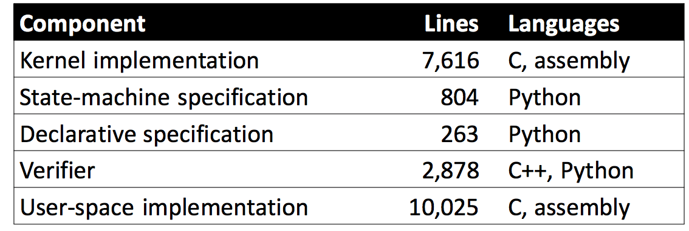

## Hyperkernel: Push-Bu on Verification of an OS Kernel

### Summary of major innovations （主要贡献）

 

* 总的来说，Hyperkernel让形式化验证简单OS kernel变得可行
* 将原本需要大量人力投入的验证过程，通过符号执行的技术和OS系统设计，在一定程度上自动化形式化验证
* 整个OS设计过程将可验证性作为第一考虑要素

### What the problems the paper mentioned?（解决的主要问题）

- 通过形式化验证的方式设计安全没有bug的内核需要投入大量的人力，而想要做到自动化校验OS code，作者们定位到一些挑战：
  - 接口设计(syscall level的验证)
    - 内核维护了一套数据结构和不变式来管理进程、虚拟内存和设备等资源。为了平衡可用性和校验自动化。Hyperkernel接口需要支持对进程隔离等高级特性的规范和验证。
    - 同时要求接口设计面向约束求解器是友好的，可以方便通过solver进行验证。
  - 虚拟内存管理
    - 原本内核的虚存并不和物理内存一一映射，同一段物理内存可以被映射到两个不同进程的虚地址上，这种设置在证明内核代码属性的时候是一个挑战，需要实现这一部分address reasoning工作。
  - C语言的model化
    - 用C语言形式化推理是非常困难的。指针算术存储器访存等low level的操作，非常难以用形式化语言建模。

### How about the important related works/papers?

* Sel4: 最主要的related work，首次实现了利用形式化验证构建安全的kernel，花费了11个person year。同时也是本文的基础。

* Program site: https://github.com/seL4
* CertiKOS: 支持多核系统的验证
* Ironclad: 用于自动化验证
  * Dafny verifier： built on Z3
* Refex
* …...

### What are some intriguing aspects of the paper?

为了解决文中提出的几个challenge：

- 内核interface的loop部分需要被特殊处理，将接口设计为finite的
  - 深入系统接口的设计代码，将原本循环递归的内核代码抽取出来放到user space
  - 系统调用，异常和中断的所有处理程序（本文中统称为trap handler程序）都设计成没有无限循环和递归，从而可以编码和 使用SMT验证它们。
- Hyperkernel的内核memory和用户空间memory分离
  - 使用内核的身份映射，从而简化了关于内核代码的推理。
  -  为了有效地实现这种分离，Hyperkernel使用Intel VT-x和AMD-V提供的x86虚拟化支持：内核进程的页在host模式下执行，用户进程的页在guest模式下运行。
- 在LLVM中间表示层（IR）级别进行形式化验证
  - LLVM IR 更好得被结构化
  - 语义比C更容易被定义，被机器理解，同时保持足够高的级别以避免关于机器细节的推理。

### How to test/compare/analyze the results?

实现部分统计如下图所示：

在这种设计模式的基础上，进行一次验证

1. 要写一个state machine specification
2. 将llvm data structure 抽象哼specification的state
3. 为中间层的代码写一个checker

according to 作者：一个syscall的平均用时小于一个小时

完成一次内核系统的验证：

* 单核处理器花费45分钟
* 而八核花费15分钟

从而说明这样的设计是scalable的

### How can the research be improved?

* H6 os 尚且只支持单处理器模式
* 部分初始化代码和一些胶水代码尚且没能被验证是无bug的

### If you write this paper, then how would you do?

可证明性的获取将系统实用性作为trade off这种。为了保证系统可证明，系统就不能太复杂，所以该文章主要叙述的是一个魔改原本xv6 os，直到便于用结合Z3和llvm ir的形式化证明方式可用的程度。

文章以dup系统调用为例，verifier将基于python的spec和implementation（从C编译的LLVM IR）都转换为SMT语句，并调用Z3执行验证。这样的叙述是对读者非常友好的。但是在对未来工作的展望时候，单纯从多核模型和部分代码没被验证角度来叙述是不够的。这样os的应用面，以及和实际可用os的差距希望还是可以讨论一下。

### Did you test the results by yourself? If so,What’s your test Results?

No，too much homework is overwhelming!

### Give the survey paper list in the same area of the paper your reading.

>[Hyperkernel homepage](https://unsat.cs.washington.edu/projects/hyperkernel/)
>
>[Hyperkernel slide](https://unsat.cs.washington.edu/papers/nelson-hyperkernel-slides.pdf)
>
>[Hyperkernel source code](https://github.com/locore/hv6/)
>
>[seL4: Formal Verification of an OS Kernel]([http://www.sigops.org/s/conferences/sosp/2009/papers/klein-sosp09.pdf](http://www.sigops.org/s/conferences/sosp/2009/papers/klein-sosp09.pdf))

