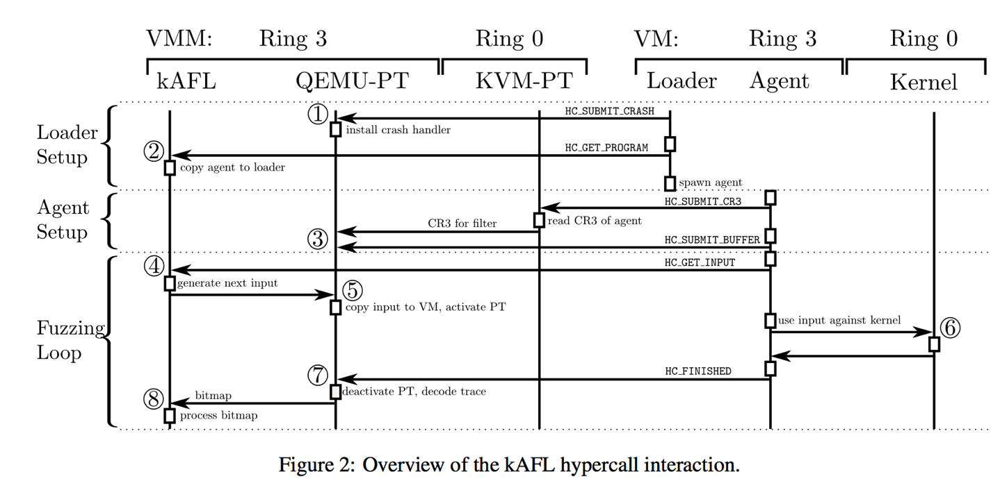

## kAFL: Hardware-Assisted Feedback Fuzzing for OS Kernels 


### Summary of major innovations （主要贡献）

 

* kAFL 将回馈输入的fuzz模式带入到了内核态的程序测试过程，实现了无需源码的内核测试
* 首次采用Intel @ Processor Trace 技术，将本来基于纯虚拟化的模糊测试技术效率提高到近30倍
* kAFL的设计遵循模块化的思想，具有可扩展性
* 研发团队奖kernel-AFL开源，鼓励研究者进行二次开发


### What the problems the paper mentioned?（解决的主要问题）


- 众所周知，内核层模糊测试面临实施流程复杂，效率低的难题。而现有的先进内核模糊测试解决方案依赖全虚拟化技术，局限在过高的额外开销。
- 而这项研究综合运用Intel PT和Intel VT-X两种cpu feature，可以高效地handle crash，快速发现分支，并且有一定的平台无关性。作者团队设计了硬件加速的内核fuzzing程序雏形，在论文中讨论他们遇到的问题并且评估测试结果。
- 需要Intel pt 记录的仅仅是目标vCPU的内核态进程产生的运行时信息，如果没有筛选机制，cpu会记录过多的无用信息；并且当数据保存在cpu subsystem buffer中的时候会面临buffer overflow的问题，进而造成trace data缺失。作者团队通过合理设计filter参数，调用intel vt中autoload msr的特点避免了冗余数据的记录，通过相邻大小buffer调用中断服务处理的方式解决buffer overflow造成的数据丢失问题。
- Intel pt 的典型trace data decoder - libipt 的效率不足以处理fuzzing产生的data，所以他们删去了libipt会记录的多余项目，并给解析器增加了便于后续处理的反汇编功能。


### How about the important related works/papers?

* Digtool [usenix 26th]，引入在内核中进行模糊测试这一主题。Digtool在内核的模糊测试非常高产，但是全虚拟化的结构限制了模糊测试发现新的分支的效能，而现在基于硬件加速的模糊测试逐渐成为了主要研究方向。在 Usenix 26th 的论文列表中，Digtool的后一篇便是 [kAFL: Hardware-Assisted Feedback Fuzzing for OS Kernels](https://link.zhihu.com/?target=https%3A//www.usenix.org/conference/usenixsecurity17/technical-sessions/presentation/schumilo)。

* 另外一些相关工作包含了近些年来反馈导向的模糊测试，也就是American fuzzing lop系列的fuzz策略(AFLfast, VUzzer, SlowFuzz, FairFuzz, AFLgo, CollAFL .etc.)。发展迅猛，并且漏洞挖掘成果丰硕，不过这些都仅限于在用户态层面。

* Syzkaller是google的安全研究人员开发并维护的内核fuzz工具。它可以自动解析syscall之间的依赖关系，为syscall准备参数等必要依赖条件，将syscall作为序列依次调用，增加fuzz可能触及的kernel程序状态，但是Syzkaller也基于Qemu的全虚拟化实现。

  

  


### What are some intriguing aspects of the paper?


总的来讲，kAFL利用了intel cpu的两个扩展特性: 1. intel vt-x虚拟化技术 2. intel pt

号称几乎没有性能上的额外开销，即使是长期放在储物柜的笔记本也可以有很好的测试表现。

而作者团队也用实际实验展现了kAFL良好的跨平台挖掘能力，发现了一些列的新的内核漏洞


- kAFL在实现过程中面临的难点包括
  - 追踪指定目标的trace data（要求不多不漏
    - filter选项、autoload msr
    - specific buffer for overflow
  - trace data decoder 效率
    - only control flow
    - cache 反汇编


### How to test/compare/analyze the results?


测试的流程包括：

1. 初始化装载器
2. 设置代理器，给kvm设置filter选项，
3. 最后开始模糊测试主循环，


我们可以看到很多hypercall在跨VM传递数据，而这些hypercall都是作者团队自己添加进去的，用来满足需求。

比较迷的是我们可以看到调用这些hypercall的代码，但是我没找到从kvm捕获hypercall的代码。。。

应该是有的或许作者没有给出或者kvm自带了处理的方法。





在实验测试中，他们首先评估了kAFL在不同平台上fuzz mount虚拟磁盘这一过程的效果，发现了8个新的漏洞，另外又测试kAFL能不能发现已知CVE。最后他们编写了一个简单的json解析驱动程序，设置一定条件下的 kernel panic（内核错误），用另外一款基于qemu的内核模糊测试工具(TriforceAFL)横向比较二者性能和效果。由于kvm经过了联合pt运行的改装，作者们还评估了改造带来的额外开销，验证他们的设计带来的负载影响很小。


以下简单点出测试反馈的重点：

- - **三种主流OS虚拟磁盘挂载BUG挖掘**

  - - **windows 没有找到bug**
    - **linux 执行速度快，效果好，找到多个unique panic**
    - **macOS 发现本地拒绝服务漏洞、可以hijack rip的uaf**

  - **keyctl 驱动cve 验证**

  - - **准确探测到cve**

  - **编写json parser驱动，利用triforceafl和kafl在不同操作系统和不同cpu核心的条件下测试发现分支的速度、各种性能**

  - - **kAFL在效率和分支发现总量上完胜triforceafl**

  - **overhead评估**

  - - **PT extention给KVM带来的overhead在百分之四以内**
    - **qemu-pt的decoder速度远胜libipt**


### How can the research be improved?


* 从fuzz的角度来讲，还有很多代码没有被测试到，kAFL 的多核性能并不优越，而种子生成的队列，如何管理，调度是一个比较重要的研究点。
* 另一方面，如何选种，哪些种子先进入测试队列，哪些种子可以被丢弃，也被讨论研究。
* 输入的变异策略该如何？从输入的哪个字节开始变异，该怎么变异，才能使控制流进入更多未测试的空间。
* AFL维护bitmap，更具bitmap检测输入是否进入新的分支，那么如何解决bitmap的hash冲突，bitmap的设计问题，等等。
* 从kernel角度，除了触发crash的漏洞，还有很多逻辑漏洞、条件竞争等漏洞存在，如何系统化地找到这些bug存在。


文章最后的Discussion部分提到了kAFL尚且存在的诸多不足以及利用intel pt可能进行的拓展研究：

1. OS独立性还不够好，loader和agent的设计模块程度不够
2. 利用intel pt 支持ring3的fuzzing
3. 针对即时编译代码的fuzzing


### If you write this paper, then how would you do?

这篇文章的逻辑非常清晰，但是和同类kernel fuzz的比较有所欠缺，可能可以增加对比实验。

### Did you test the results by yourself? If so,What’s your test Results?

No， i have no processor with intel pt.

what a pity!

### Give the survey paper list in the same area of the paper your reading.


```

Skyfire (Oakland17):
Learn&Fuzz (ASE17):
GAN (2017/11)
Neuzz (Oakland19):

Driller (NDSS16):
T-Fuzz (Oakland18):
QSYM (CC18)
DigFuzz (NDSS19)

AFLfast (CCS16),
VUzzer (NDSS17),
AFLgo(CCS17),

QTEP(FSE17),
SlowFuzz (CCS17)
FairFuzz (ASE18)

REDQUEEN (NDSS19)
Angora(Oakland18)
ProFuzzer (Oakland19)

AddressSanitizer (ATC12):
Meds (NDSS18)
Razar (S&P19)


```


ps: https://zhuanlan.zhihu.com/p/30792522 这篇专栏的作者就是我

